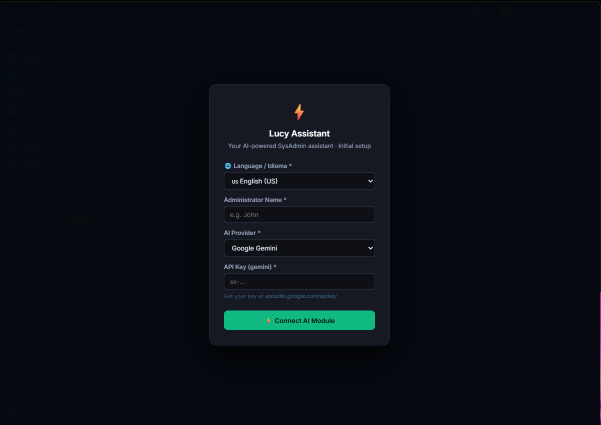
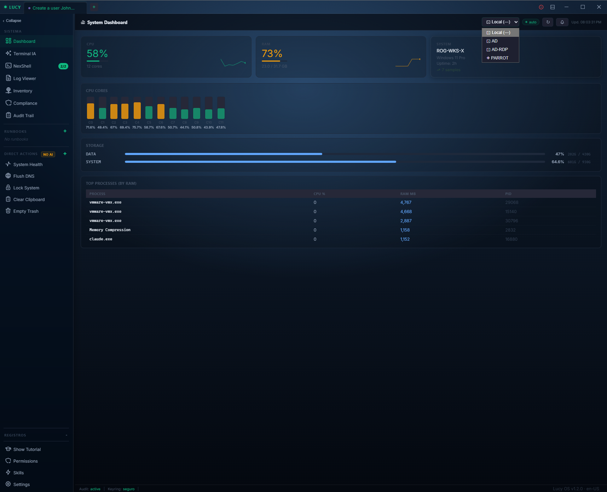
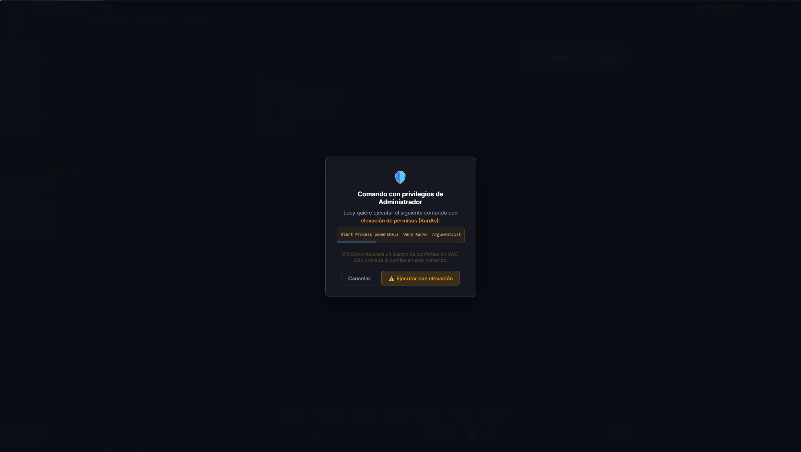
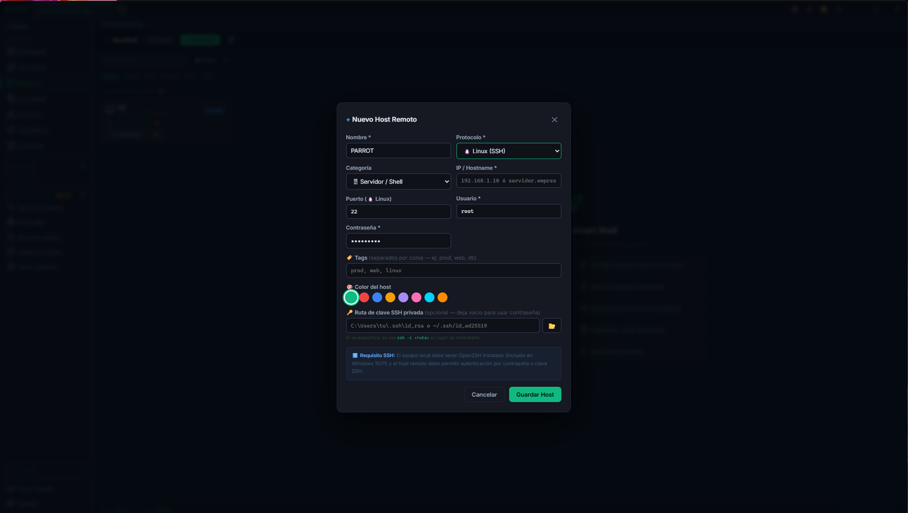
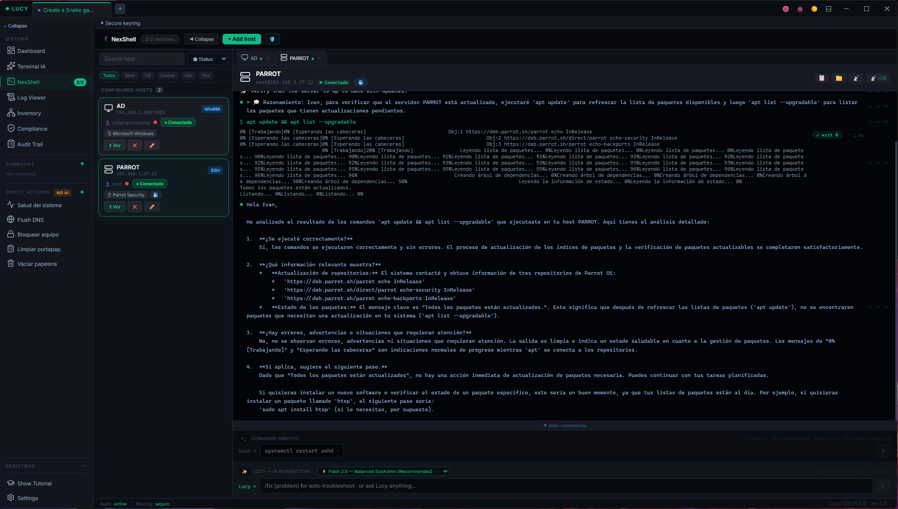
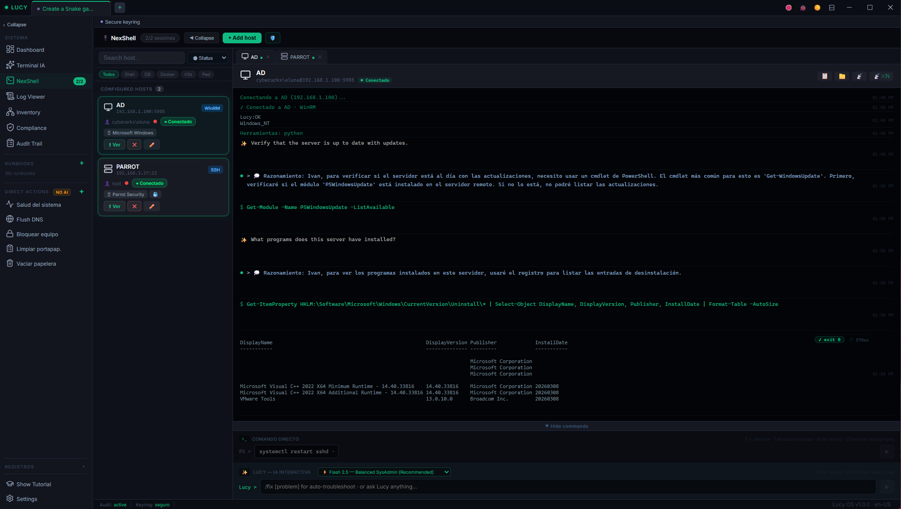
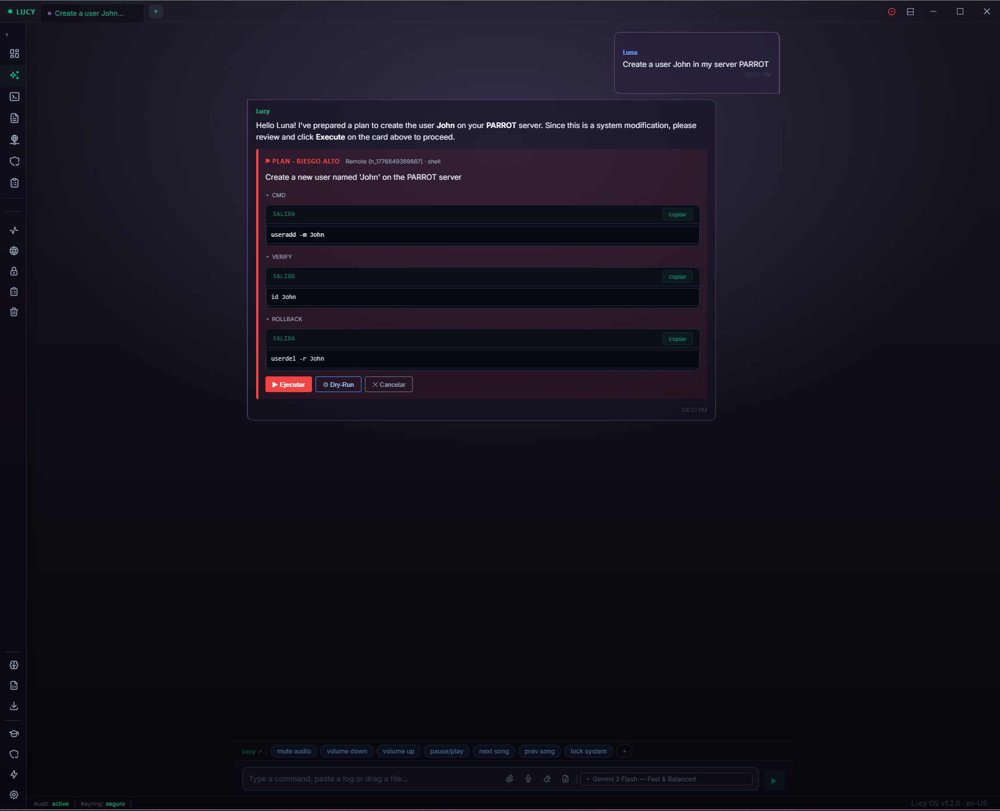

<p align="center">
  
</p>

<h1 align="center">Lucy Assistant</h1>

<p align="center">
  <strong>Autonomous SysAdmin AI Assistant</strong><br>
  Desktop application for infrastructure management, compliance auditing, and remote administration — powered by LLM intelligence.
</p>

<p align="center">
  
  
  
  
</p>

---

## Overview

Lucy is a desktop AI assistant designed for system administrators. It combines a conversational LLM interface with real infrastructure tooling — remote shell execution, log analysis, CIS compliance scanning, and credential management — all from a single, secure desktop app.

Built with **Tauri 2** (Rust backend) and **SvelteKit 5** (frontend), Lucy runs natively on Windows with minimal resource overhead.

## Demo Video

[](https://www.youtube.com/watch?v=-baowyd16kc)

**[Watch Full Demo on YouTube](https://www.youtube.com/watch?v=-baowyd16kc)** — See Lucy in action managing infrastructure, running compliance checks, and automating SysAdmin tasks.

## Core Features: The Agentic OS

Lucy has evolved from a conversational tool into a fully **Autonomous Agentic OS**:

- **Sub-Agents & Parallel Orchestration** — Fork tasks natively to independent background agents using Ollama (Local) or Cloud models, allowing simultaneous multi-threaded execution.
- **Self-Healing Execution Loop** — If Lucy encounters an error running a command (e.g., PowerShell access denied), she intercepts the terminal output on the fly, auto-corrects her approach, and retries until success without user intervention.
- **OpenClaw TCP Gateway** — Integrated native webhook listener on port `31337`. External systems can trigger Lucy instantly, automatically spawning dedicated Agent Tabs to process the events.
- **Claude Mem (Anti-Amnesia)** — Lucy securely saves architectural memory seamlessly into `workspace_memory.md`, retaining context across sessions and preserving knowledge permanently.
- **Graphify AST Integration** — Advanced codebase parsing hooks allowing Lucy to query Abstract Syntax Trees to map logic accurately.
- **Local LLM Emancipation** — Auto-parsers convert markdown into native OS commands instantly. Restricted local models (like `llama3`, `qwen`) can operate as unrestricted SysAdmin executors, massively reducing token latency with dynamic environment injection.

### Standard SyAdmin Features

- **Remote Shell (NexShell)** — Execute commands on remote Windows and Linux hosts via SSH/WinRM
- **Log Viewer & Infrastructure Inventory** — Monitor event logs, auto-discover services, and track installed software
- **CIS Compliance** — Run strict CIS benchmark checks against Windows and Linux baselines
- **Audit Trail & Reports** — Export PDF reports and log every administrative action securely
- **Credential Vault** — Secure API key and host credential storage via OS keyring

## Screenshots

### Main Interface & Dashboard



### AI Chat & Features



### Infrastructure & Compliance




### Advanced Features




## Prerequisites

- [Node.js](https://nodejs.org/) >= 18
- [Rust](https://rustup.rs/) >= 1.70
- [Tauri CLI](https://tauri.app/start/prerequisites/) prerequisites (WebView2 on Windows)

## Getting Started

```bash
# Clone the repository
git clone https://github.com/Phenomx64L/LucyAI.git
cd LucyAI

# Install frontend dependencies
npm install

# Run in development mode
npm run tauri dev

# Build for production
npm run tauri build
```

The production build generates Windows installers (NSIS + MSI) in `src-tauri/target/release/bundle/`.

## Project Structure

```
lucy-svelte/
├── src/                      # Frontend (SvelteKit)
│   ├── routes/
│   │   └── +page.svelte      # Main application view
│   └── lib/
│       ├── *View.svelte       # Feature views (Dashboard, NexShell, Logs, etc.)
│       ├── *Modal.svelte      # Modal dialogs (Host, Keyring, Profile, etc.)
│       ├── lucy-api.ts        # Tauri command bridge
│       ├── stores.ts          # Svelte reactive stores
│       ├── skill-engine.ts    # Skill execution engine
│       └── hooks/             # Command guard & turn loop
├── src-tauri/                 # Backend (Rust + Tauri)
│   ├── src/
│   │   ├── lib.rs             # Tauri command registration
│   │   ├── state.rs           # Application state
│   │   ├── commands/          # Command modules
│   │   │   ├── ai.rs          # LLM integration
│   │   │   ├── hosts.rs       # Remote host execution
│   │   │   ├── shell.rs       # Interactive shell
│   │   │   ├── compliance.rs  # CIS benchmark checks
│   │   │   ├── inventory.rs   # Infrastructure discovery
│   │   │   ├── logs.rs        # Log reading
│   │   │   └── ...
│   │   └── utils/             # Shell & logging utilities
│   └── tauri.conf.json        # Tauri configuration
├── static/                    # Static assets
└── package.json
```

## Tech Stack

| Layer    | Technology                         |
| -------- | ---------------------------------- |
| Frontend | SvelteKit 5, Vite 6, TypeScript    |
| Backend  | Rust 2021, Tauri 2.0, Tokio        |
| AI       | LLM via API (configurable)         |
| Security | OS Keyring, CSP headers, DOMPurify |
| UI       | Lucide icons, Highlight.js, Marked |
| Database | SQLite (tauri-plugin-sql)           |
| Reports  | jsPDF + AutoTable                  |

## Configuration

Lucy stores credentials securely in the OS keyring. On first launch, the setup overlay will guide you through:

1. Setting your LLM API key
2. Configuring your first host profile
3. Selecting your preferred language (EN/ES)

## Available Scripts

| Command                  | Description                        |
| ------------------------ | ---------------------------------- |
| `npm run dev`            | Start Vite dev server              |
| `npm run build`          | Build frontend for production      |
| `npm run preview`        | Preview production build           |
| `npm run check`          | Run svelte-check type validation   |
| `npm run tauri dev`      | Launch full app in dev mode        |
| `npm run tauri build`    | Build native desktop installer     |

## Security Considerations

- API keys are stored in the OS keyring, never in plaintext files
- All HTML rendering is sanitized with DOMPurify
- CSP headers restrict external connections to configured API endpoints
- Remote command execution requires explicit host configuration and credentials

## Contributing

1. Fork the repository
2. Create a feature branch (`git checkout -b feature/my-feature`)
3. Commit your changes (`git commit -m 'Add my feature'`)
4. Push to the branch (`git push origin feature/my-feature`)
5. Open a Pull Request

See [CONTRIBUTING.md](CONTRIBUTING.md) for detailed guidelines.

## Support Lucy AI

Love Lucy? Consider supporting development! Your contribution helps improve the project and keeps it free and open source.

### 💝 Sponsor Options

- **[GitHub Sponsors](https://github.com/sponsors/Phenomx64L)** — Direct sponsorship
- **[Buy Me a Coffee](https://www.buymeacoffee.com/phenomx64l)** — One-time or recurring
- **[Patreon](https://patreon.com/lucy-ai)** — Monthly support
- **[PayPal](https://paypal.me/phenomx64l)** — Donation

### 🙏 Other Ways to Help

- ⭐ **Star the repository** — Helps visibility
- 🐛 **Report bugs** — Create detailed issues
- 💡 **Suggest features** — Share your ideas
- 🔧 **Contribute code** — Submit PRs
- 📢 **Share Lucy** — Tell others about it

## License

This project is licensed under the MIT License. See [LICENSE](LICENSE) for details.

This project is licensed under the MIT License. See [LICENSE](LICENSE) for details.

---

<p align="center">
  Built with Tauri + SvelteKit + Rust
</p>
